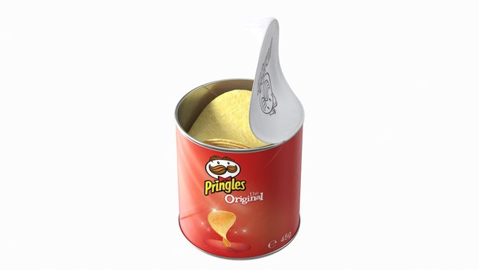
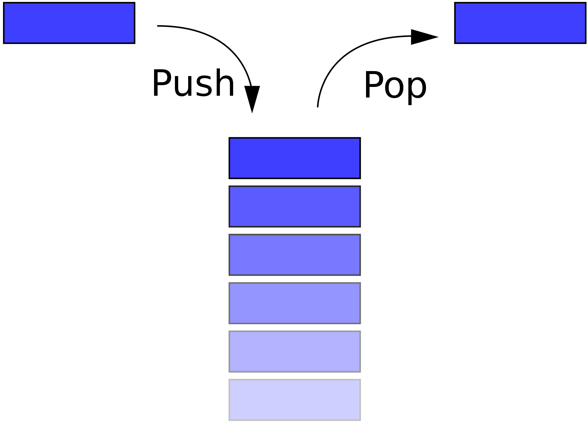

# Stacks
Stacks is a data structure that uses the LIFO (last in, first out) method. This is used as a way to prioritize the order in which task are complete within your program. 

# I. Pringles
A good example of the LIFO rule would be to look at a can of Prigles. With this, the factory will load all of the chips into a cylinder can. The first chip in the can will go to the very bottom. Every following chip will be placed on top of the previous chip. With this, the first chip that he consumer can access is the last chip that was placed into the can. The last chip in is the first chip out. 



# II. Terms
Some of the terms that you need to understand when working with stacks are: Push, Pop, Front, and Back

* Push - This is when you place an item into the stack
* Pop - This is when you remove an Item from the stack
* Front - Using the Pringle example, This would be the bottom of the can/ the first chips placed into the can
* Back - This refers to the side with the most recent items added to the stack



# III. Coding Stacks
Working with stacks is not that difficult. In fact, there is a chance that you have already used this method before without knowing. To understand how to use stacks in python we need to lay the ground work. 

First off, creating the stack. This can be done by typing the name you want for the stack, an equal sign, then an empty bracket.
``` python
stack = []
```
You could also fill the stack from here like so:
``` python
stack = ['A', 'B', 'C']
```
In this example, 'A' would be the Front of the stack with 'C' as the Back.

If we were to push an item to the empty list above, we would use the 'append' opperation. Append adds an item to the back of the stack. This can be done using this method.
``` python
stack = []
stack.append('A')
# If we were print stack from this point it would display "['A']"
```
If we wanted to remove an item from a list we would use the 'pop' apperation. This will remove the most recent item added to the stack. This can be done using the following method:
``` python
stack = ['A', 'B', 'C']
stack.pop()
# If we were print stack from this point it would display "['A', 'B']"
```
Note: You can also place a number inside the parenthesis to remove the item in that spot
``` python
stack = ['A', 'B', 'C']
# stack = [0, 1, 2]
stack.pop(1)
# If we were print stack from this point it would display "['A', 'C']"
```

Extra Code To Use With Stacks:
``` python
stack = ['A', 'B', 'C']
len(stack) # This will return the number of items in the stack.

for i in stack: 
    print(i) #This will iterate through each item in the stack individually 

stack.clear() # This will remove all items from the stack
```

[Full Code Example](stacks.py)

<details>
<summary>Click to toggle contents of `code`</summary>
```
CODE!
```
</details>
