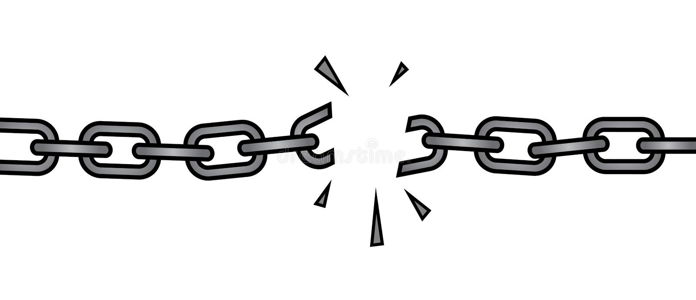

# Linked Lists

Linked list are a great we for organization of data. Much like a physical chain, a linked list is a list of items all connected to eachother. Each item in the list is called a node. All of the items can be stored throughout the memory of your device with each node holding a path to the previous and next node.

# Nodes

A node is a link in a chain. The node is connected to two other nodes, the previous one and the next one. The first node in a linked list is called the head and the last one is called the tail. 

<details>
<summary>Further explanation of image</summary>

This image is a great visual example of a linked list with nodes. You can see each nodes holding data ('A', 'B', 'C', 'D') and you can see each node has a connection to the previous ('Prev') and 'Next' node. The 'Head' and tail each point at one node with the other path currently held as 'NULL'.

</details>


<br>

# How to Insert Into a Linked List 
With each item in a linked list pointing towards the previous and next node, it may be difficult to instert data into one may be a little difficult to understand.

<br>

**Insert At Head**

When insert into the head of a linked list you will need to complete four steps. 

* Create the new node (new_node)
* Set the next connection of the new_node to the current head (new_node.head = self.head)
* Set the previous connection of the current head to the new node (self.head.prev = new_node)
* Set the head equal to the new node (self.head = new_node)

<br>

**Insert At Tail**

Inserting into the tail of a linked list is very similar to inserting into the head.

* Create the new node (new_node)
* Set the next connection of the new_node to the current tail (new_node.prev = self.tail)
* Set the previous connection of the current head to the new node (self.tail.next = new_node)
* Set the head equal to the new node (self.tail = new_node)

<br>

**Insert Into Middle**

Inserting into the middle of a linked list is a lot harder to understand. When doing this you have to change the connections to each node that the new one will be touching. 

* Create a new node (new_node)
* Set the previous connection of the new node to the current node (new_node.prev = current)
* Set the next connection of the new node to the next node after current (new_node.next = current.next)
* Set the "prev" of the "next" node after current to the new node (current.next.prev = new_node)
* Set the next of the current node to the new node (current.next = new_node)


[Source for all steps with images](https://byui-cse.github.io/cse212-course/lesson07/07-prepare.html#1.1)

<br>

# Removing From Linked Lists

Removing from a linked list is not too hard to understand if everything up to this point has made sense. When doing this you need to make sure that no connections are ruined. Just like if a link in a chain broke, you would need to remove it then connect the two links it was touching.



<br>

**Removing From Head**

Removing from the head is pretty easy. It can be done using these two steps:

* Set the previous connection of the second node to nothing (self.head.next.prev = None)
* Set the head to be the second node (self.head = self.head.next)

<br>

**Removing From Tail**

Much like adding to the tail, removing from the tail is very similar to removing from the head. It can be done using these two steps:

* Set the next connection of the second node to nothing (self.head.prev.next = None)
* Set the tail to be the second node (self.tail = self.tail.prev)

<br>

**Removing From Middle**

Unlike adding to the middle, removing from the middle can be done in only two steps:

* Set the previous connection of the node after current to the node before current (current.next.prev = current.prev)
* Set the next of the node before current to the node after current (current.prev.next = current.next)


<details>
<summary>Note on removing from linked list</summary>

When you remove an item from a linked list you do not need to manually delete it from memory. This will happen automatically. 
</details>

<br>

# Coding example

Here is a simple example of starting at the end of a linked list then looping through until coming back to the beginning:

```python

def iter_backwords(self):
    # set the current node (cur) to the tail of the linked list
    cur = self.tail

    while cur is not None:
        # This is how you print the data held in a node
        print(cur.data)
        # Set the new current node to the previous connection
        cur = cur.prev

```


# Coding Problem

Now that you have an undertanding of linked list and have seen a small example of the code in use, lets try to have you solve a problem. 

<br>

<details>
<summary> Hint</summary>

Start by iterating through the list using a while loop until you find the correct vaule

</details>


```python
'''
Some of this code was barrowed from W07: Prove assignment
Brigham Young University-Idaho
CSE-212: Brother Kay
'''

# DO NOT CHANGE BELOW
class LinkedList:
    class Node:
        def __init__(self, data):
            self.data = data
            self.next = None
            self.prev = None
    def __init__(self):
        self.head = None
        self.tail = None
    def populate_ll(self, value):
        new_node = LinkedList.Node(value)  
        if self.head is None:
            self.head = new_node
            self.tail = new_node
        else:
            new_node.next = self.head 
            self.head.prev = new_node 
            self.head = new_node 
# DO NOT CHANGE ABOVE


    # Populate this code so that it removes '3' from the linked list
    # Note: treat value as 3, it is already called at the bottome of this code
    def remove(self, value):
        curr = self.head 
        while curr is not None:
            pass
        pass


    # DO NOT CHANGE BELOW
    def __iter__(self):
        curr = self.head 
        while curr is not None:
            yield curr.data  
            curr = curr.next 
    def __str__(self):
        output = "\n["
        first = True
        for value in self:
            if first:
                first = False
            else:
                output += ", "
            output += str(value)
        output += "]\n"
        return output
    # DO NOT CHANGE ABOVE


ll = LinkedList()
ll.populate_ll(1)
ll.populate_ll(2)
ll.populate_ll(3)
ll.populate_ll(4)
ll.populate_ll(5)

print(ll)

ll.remove(3)

print(ll)

```


<details>
<summary> Solution</summary>

```python
'''
Some of this code was barrowed from W07: Prove assignment
Brigham Young University-Idaho
CSE-212: Brother Kay
'''

# DO NOT CHANGE BELOW
class LinkedList:
    class Node:
        def __init__(self, data):
            self.data = data
            self.next = None
            self.prev = None
    def __init__(self):
        self.head = None
        self.tail = None
    def populate_ll(self, value):
        new_node = LinkedList.Node(value)  
        if self.head is None:
            self.head = new_node
            self.tail = new_node
        else:
            new_node.next = self.head 
            self.head.prev = new_node 
            self.head = new_node 
# DO NOT CHANGE ABOVE


    # Populate this code so that it removes '3' from the linked list
    # Note: treat value as 3, it is already called at the bottome of this code
    def remove(self, value):
        curr = self.head 
        while curr is not None:
            if curr.data == value:
                if curr.prev is None:
                    self.head.next.prev = None
                    self.head = self.head.next
                    return
                elif curr.next is None:
                    self.tail.prev.next = None
                    self.tail = self.tail.prev
                    return
                else:
                    curr.next.prev = curr.prev
                    curr.prev.next = curr.next
                    return 
            else:
                curr = curr.next 


    # DO NOT CHANGE BELOW
    def __iter__(self):
        curr = self.head 
        while curr is not None:
            yield curr.data  
            curr = curr.next 
    def __str__(self):
        output = "\n["
        first = True
        for value in self:
            if first:
                first = False
            else:
                output += ", "
            output += str(value)
        output += "]\n"
        return output
    # DO NOT CHANGE ABOVE


ll = LinkedList()
ll.populate_ll(1)
ll.populate_ll(2)
ll.populate_ll(3)
ll.populate_ll(4)
ll.populate_ll(5)

print(ll)

ll.remove(3)

print(ll)

```


</details>


----------
Sources Used:

[CIT 212 - W07 Prepare: Reading](https://byui-cse.github.io/cse212-course/lesson07/07-prepare.html#1.1)

[Nodes Image](https://encrypted-tbn0.gstatic.com/images?q=tbn:ANd9GcQTVXahxIf8UD8-AD1MIDbr0sE5JVbY_8aOXw&usqp=CAU)

[Broken Chain Image](https://thumbs.dreamstime.com/b/broken-chain-draw-39081376.jpg)