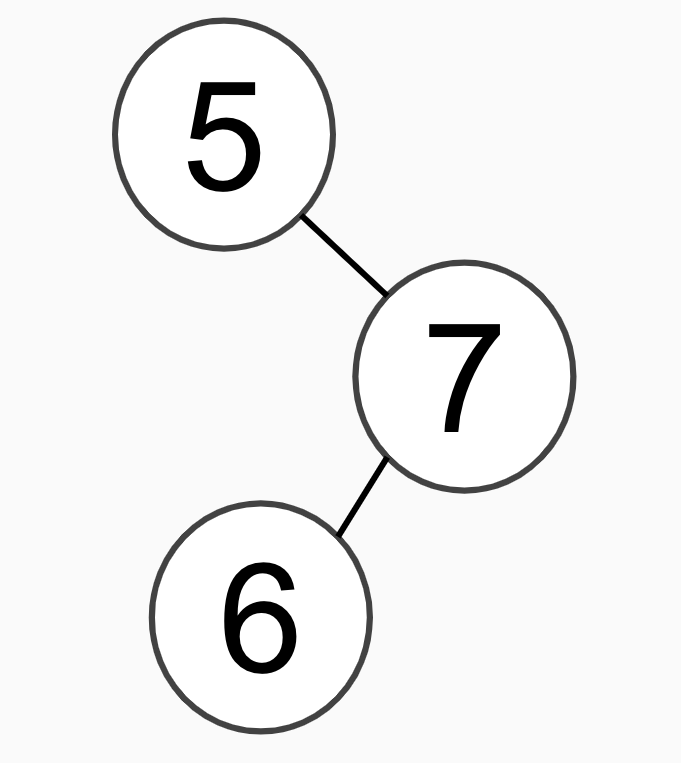
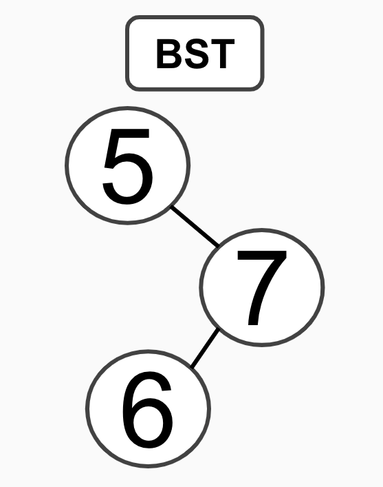
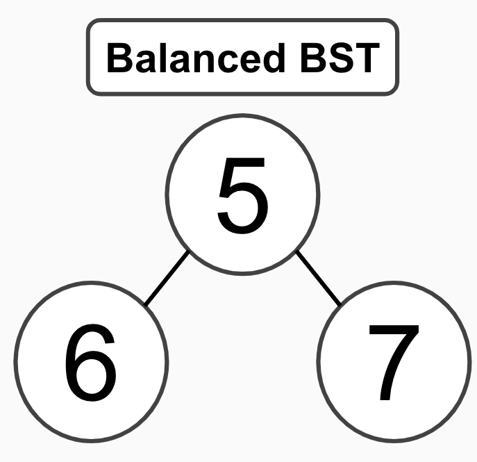

# Trees

Trees are a great way to keep track of large amount of data using bionary sorting methods. An example of a tree that most people have already seen is a family tree. I will show more examples of this throughout this lesson. 

# Visual Example

This image is an example of a bionary tree. In a bionary tree there is never more then two connections to a node (piece of data). 

Terms in reference to image

 
The first node is refered to as the root. In this example that would be 1. 

1,2, and 3 are all parent nodes (1 is the parent to 2 and 3) meaning that they all have at least one child node. A child node is a node connected to the parentnode.

4,5,6, and 7 are all leaves which means that they do not have any other connections then to the parents. 

The last thing that you need to know about is subtrees. In this example 1 has two subtrees. 2, 4, and 5 make up one and 3, 6, and 7 make up the other. 

 

# Binary Search Tree

A Binary Search Tree (BST) is a form of organization for a binary tree. In a BST you would create rules as to how the data is placed in the tree. Such as if it is a higher number it goes to the right and a lower number goes to the left. 

The new node will never be placed ahead of an existing node. You would follow the rules for the data placement until you arrive at a leaf. 

Example of BST

 

If you started a BST with the number 5, that would be your root. Then if your next number was 7, a higher number, it would go to the right of the root. If your number after that was 6, a higher number, then you would look to the right side. Sense the right side already has 7, a higher number than 6, 6 would go to the left side of 7, making 7 the parent of 6.

 

# Balanced Binary Search Tree

The difference between a BST and a Balanced Binary Search Tree (Balanced BST) is that with a Balanced BST, you will never have a subtree longer than it needs to be. 

Image Examples

 

 

More infor about [Balanced Binary Search Tree](https://www.tutorialspoint.com/balanced-binary-tree-in-python) in python

 

* Code Example
* Practice Code
* Practice Code Solution

 
----------
Sources Used:

[CIT 212 - W09 Prepare: Reading](https://byui-cse.github.io/cse212-course/lesson09/09-prepare.html#1.1)

[Tree Image](https://cdn.programiz.com/sites/tutorial2program/files/perfect-binary-tree_0.png)

[Balanced Binary Search Tree](https://www.tutorialspoint.com/balanced-binary-tree-in-python)