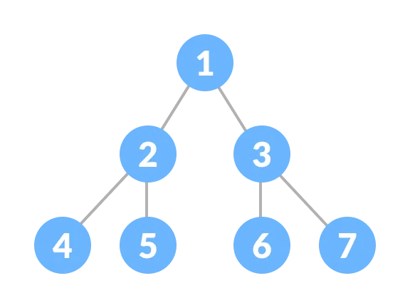
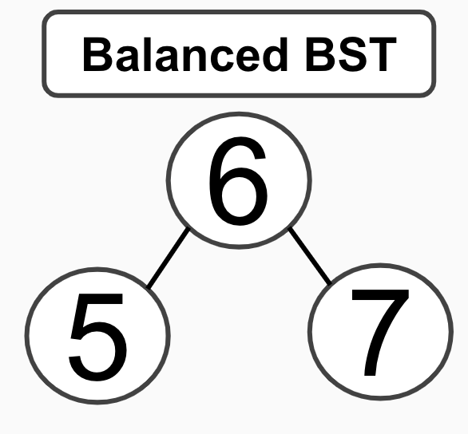

# Trees

Trees are a great way to keep track of large amount of data using bionary sorting methods. An example of a tree that most people have already seen is a family tree. I will show more examples of this throughout this lesson. 

# Visual Example



This image is an example of a bionary tree. In a bionary tree there is never more then two connections to a node (piece of data). 

<details>
<summary>Terms in reference to image</summary>
<br>
The first node is refered to as the root. In this example that would be 1. 

1,2, and 3 are all parent nodes (1 is the parent to 2 and 3) meaning that they all have at least one child node. A child node is a node connected to the parentnode.

4,5,6, and 7 are all leaves which means that they do not have any other connections then to the parents. 

The last thing that you need to know about is subtrees. In this example 1 has two subtrees. 2, 4, and 5 make up one and 3, 6, and 7 make up the other. 

</details>
<br>

# Binary Search Tree

A Binary Search Tree (BST) is a form of organization for a binary tree. In a BST you would create rules as to how the data is placed in the tree. Such as if it is a higher number it goes to the right and a lower number goes to the left. 

The new node will never be placed ahead of an existing node. You would follow the rules for the data placement until you arrive at a leaf. 

<details>
<summary>Example of BST</summary>
<br>

If you started a BST with the number 5, that would be your root. Then if your next number was 7, a higher number, it would go to the right of the root. If your number after that was 6, a higher number, then you would look to the right side. Sense the right side already has 7, a higher number than 6, 6 would go to the left side of 7, making 7 the parent of 6.


</details>

<br>

# Balanced Binary Search Tree

The difference between a BST and a Balanced Binary Search Tree (Balanced BST) is that with a Balanced BST, you will never have a subtree longer than it needs to be. For this you would rearrange the tree to have as close to equal lengths on both sides as possible. 

<details>
<summary>Image Examples</summary>
<br>




</details>
<br>

More infor about [Balanced Binary Search Tree](https://www.tutorialspoint.com/balanced-binary-tree-in-python) in python

 # Inserting Into BST

 When inserting into a BST you will need to understand recursion. If you do not know about recursion please watch [this video](https://www.youtube.com/watch?v=wMNrSM5RFMc). 

Read through the comments on this code.

``` python
class Node:
    def __init__(self, val=None):
        '''
        Initialize the node
        '''

        self.left = None
        self.right = None
        self.val = val

    def insert(self, val):
        '''
        This function will allow you to insert your data into the
        tree. 
        '''

        # Check if self.val is empty, if so make it equal to the value you passed in
        if not self.val:
            self.val = val
            return
        # Check to see if the number is less than the current value
        if val < self.val:
            # Check to see if self.left is carrying a value
            if self.left:
                # If so call the function again
                self.left.insert(val)
                return
            # If you have found the end of a tree, place the value there
            self.left = Node(val)
            return
        # Check to see if self.right is carrying a value
        if self.right:
            # If so call the function again
            self.right.insert(val)
            return
        # If you have found the end of a tree, place the value there
        self.right = Node(val)
```


<br>

# Code Problem

For this problem you will need to populate the 'in_list' and 'ordered' functions to get the desired output. Please refure to the 'insert' function for help. 

``` python
class Node:
    def __init__(self, val=None):
        '''
        Initialize the node
        '''

        self.left = None
        self.right = None
        self.val = val


    def insert(self, val):
        '''
        This function will allow you to insert your data into the
        tree. 
        '''

        # Check if self.val is empty, if so make it equal to the value you passed in
        if not self.val:
            self.val = val
            return
        # Check to see if the number is less than the current value
        if val < self.val:
            if self.left:
                # If it is less it will call the function again recursively
                self.left.insert(val)
                return
            self.left = Node(val)
            return
        if self.right:
            # If it is greater it will call the function again recursively
            self.right.insert(val)
            return
        self.right = Node(val)

        if self.right:
            # If it is greater it will call the function again recursively
            self.right.insert(val)
            return
        self.right = Node(val)


    # Finish this function
    def in_list(self, val):
        '''
        This function will look through the whole list to see if the 
        val is in the tree. 
        '''

        # Add your code Below


        # Add your code Above


    # Finish this function
    def ordered(self, vals):
        '''
        This function will check whole left side of the tree then the 
        right side of the tree while adding each leaf to the empty list
        (vals). Checking in this order will make the list order itself 
        from smallest to biggest.
        '''

        # Add your code Below


        # Add your code Above

        

def main():
    # Create a list or random numbers
    nums = [20, 1, 19, 2, 18, 3, 17, 4, 16, 5]
    bst = Node()

    # Run the insert statement for each number in the nums list
    for num in nums:
        bst.insert(num)
    print("Unordered List: ")
    print(nums)
    print("Ordered List: ")
    print(bst.ordered([]))
    print()

    for i in range(1,10):
        print(f"Is {i} in the tree: ")
        # Check if each number in the range is or is not in the tree
        print(bst.in_list(i))

main()


'''
OUTPUT:

Unordered List: 
[20, 1, 19, 2, 18, 3, 17, 4, 16, 5]
Ordered List: 
[1, 2, 3, 4, 5, 16, 17, 18, 19, 20]

Is 1 in the tree: 
True
Is 2 in the tree: 
True
Is 3 in the tree: 
True
Is 4 in the tree: 
True
Is 5 in the tree: 
True
Is 6 in the tree: 
False
Is 7 in the tree: 
False
Is 8 in the tree: 
False
Is 9 in the tree: 
False
'''


```

<details>
<summary>Solution</summary>

<br>

``` python

class Node:
    def __init__(self, val=None):
        '''
        Initialize the node
        '''

        self.left = None
        self.right = None
        self.val = val
        
    def insert(self, val):
        '''
        This function will allow you to insert your data into the
        tree. 
        '''

        # Check if self.val is empty, if so make it equal to the value you passed in
        if not self.val:
            self.val = val
            return
        # Check to see if the number is less than the current value
        if val < self.val:
            if self.left:
                # If it is less it will call the function again recursively
                self.left.insert(val)
                return
            self.left = Node(val)
            return
        if self.right:
            # If it is greater it will call the function again recursively
            self.right.insert(val)
            return
        self.right = Node(val)

    def in_list(self, val):
        '''
        This function will look through the whole list to see if the 
        val is in the tree. 
        '''

        # Check to see if the current value is equal the the value you are looking for
        if val == self.val:
            return True
        # Check if the value is less than the one you are looking for 
        if val < self.val:
            # If you have reached the end of the tree and have not found the value, return False
            if self.left == None:
                return False
            # If you have not found the end or the value, call the funtion again
            return self.left.in_list(val)
        # If you have reached the end of the tree and have not found the value, return False
        if self.right == None:
            return False
        # If you have not found the end or the value, call the funtion again
        return self.right.in_list(val)

    def ordered(self, vals):
        '''
        This function will check whole left side of the tree then the 
        right side of the tree. Checking in this order will make the 
        list order itself from smallest to biggest.
        '''

        # If you have not reached the end of the tree, call the function again
        if self.left is not None:
            self.left.ordered(vals)
        # If value is not none add it to the list of values
        if self.val is not None:
            vals.append(self.val)
        # If you have not reached the end of the tree, call the function again
        if self.right is not None:
            self.right.ordered(vals)
        return vals

def main():
    # Create a list or random numbers
    nums = [20, 1, 19, 2, 18, 3, 17, 4, 16, 5]
    bst = Node()

    # Run the insert statement for each number in the nums list
    for num in nums:
        bst.insert(num)
    print("Unordered List: ")
    print(nums)
    print("Ordered List: ")
    print(bst.ordered([]))
    print()

    for i in range(1,10):
        print(f"Is {i} in the tree: ")
        # Check if each number in the range is or is not in the tree
        print(bst.in_list(i))

main()


'''
OUTPUT:

Unordered List: 
[20, 1, 19, 2, 18, 3, 17, 4, 16, 5]
Ordered List: 
[1, 2, 3, 4, 5, 16, 17, 18, 19, 20]

Is 1 in the tree: 
True
Is 2 in the tree: 
True
Is 3 in the tree: 
True
Is 4 in the tree: 
True
Is 5 in the tree: 
True
Is 6 in the tree: 
False
Is 7 in the tree: 
False
Is 8 in the tree: 
False
Is 9 in the tree: 
False
'''


```

</details>

<br>
----------
Sources Used:

[CIT 212 - W09 Prepare: Reading](https://byui-cse.github.io/cse212-course/lesson09/09-prepare.html#1.1)

[Tree Image](https://cdn.programiz.com/sites/tutorial2program/files/perfect-binary-tree_0.png)

[Balanced Binary Search Tree](https://www.tutorialspoint.com/balanced-binary-tree-in-python)

[Source Used For Code](https://blog.boot.dev/computer-science/binary-search-tree-in-python/)


